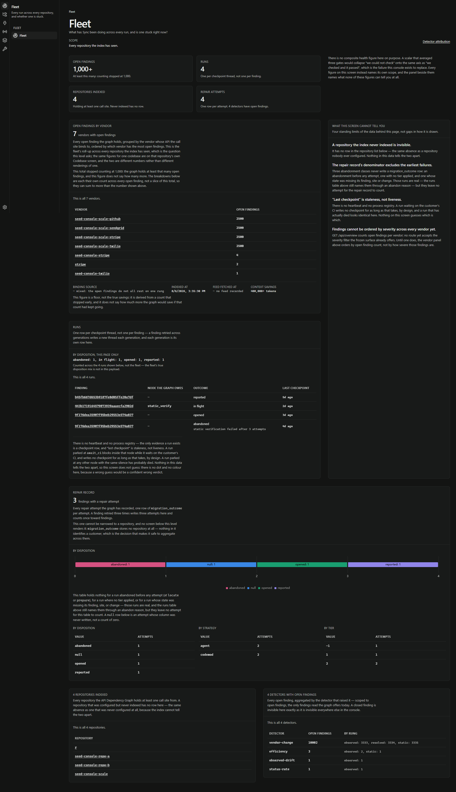
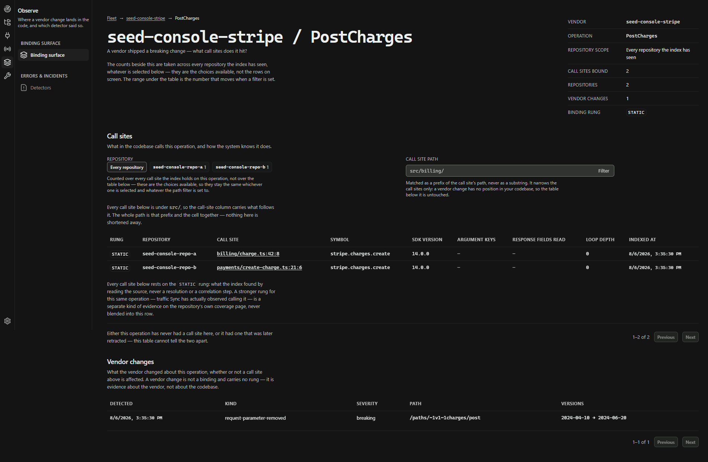
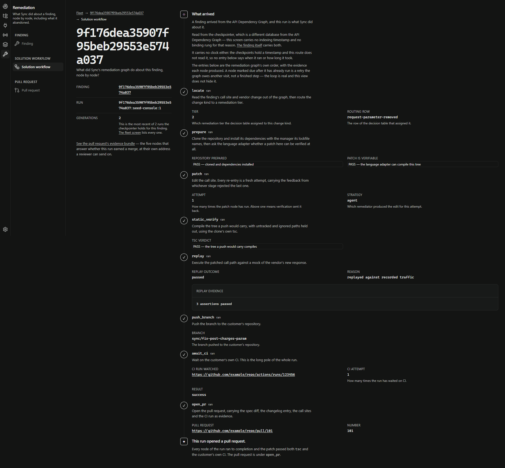
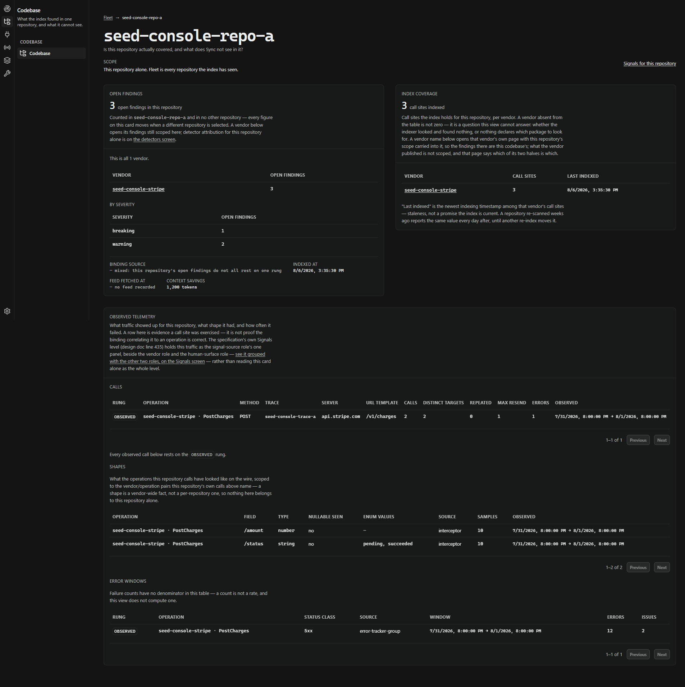
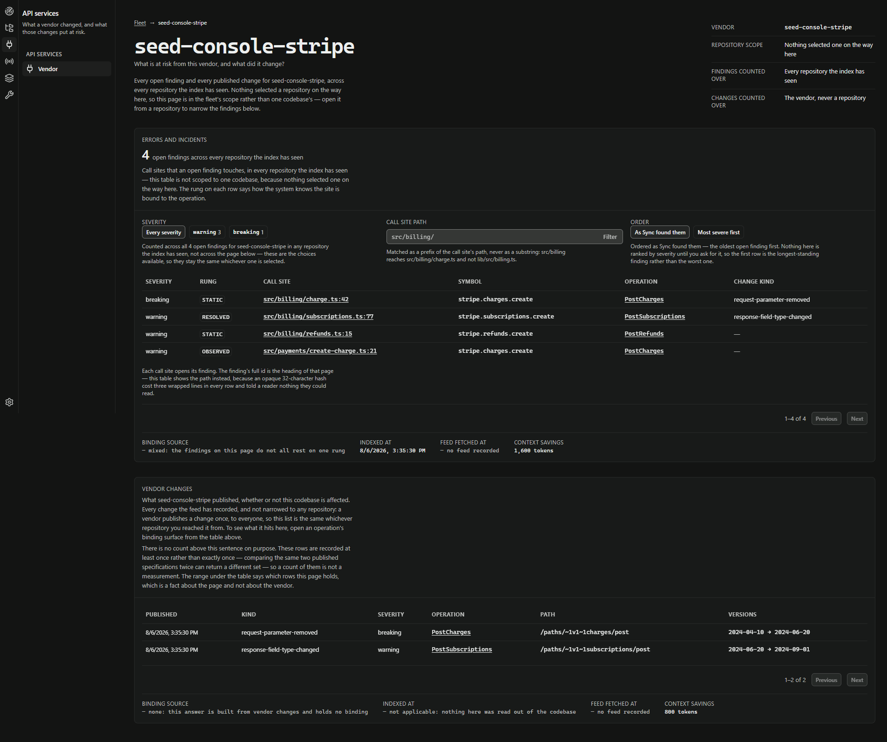

<div align="center">

# Sync

### Self-maintaining API integrations

**Sync watches the third-party APIs your code calls. When one breaks, drifts, or starts costing you money, it opens a pull request that fixes your code — already verified green by your own CI.**

[](https://www.python.org/)
[](https://github.com/langchain-ai/langgraph)
[](https://www.postgresql.org/)
[](LICENSE)
[](#status-pre-alpha-and-specific-about-it)

</div>

```
vendor ships a breaking change  →  Sync finds every call site that depends on it
                                →  patches them
                                →  runs your CI
                                →  opens a PR carrying the evidence
```

---

## The problem nobody owns

Every codebase depends on APIs it does not control, and those APIs change. Fields are removed,
endpoints are deprecated, defaults shift, cheaper endpoints ship quietly. The consuming team finds
out when production breaks — if at all. At AWS, more than 30% of one organisation's service
downtime traced to external API and package changes that nobody noticed.

The tooling that exists watches the wrong side of the wire.

| | Watches | Acts on | Verifies |
|---|---|---|---|
| SmartBear, Treblle, Levo, Optic, Postman-Akita | The API **you publish** | Raises an alert | — |
| Dependabot / Renovate | Package **versions** | Opens a version-bump PR | Your CI |
| Codemod tools (`ast-grep`, `jscodeshift`) | Nothing — you point them | Applies a transform you wrote | — |
| **Sync** | The APIs **you consume**, across vendors | Patches the calling code | `tsc`, then **your own CI**, before the PR exists |

Dependabot solved exactly this shape for package *versions* and never extended to API *semantics*.
Sync closes that gap.

### What actually makes it different

Four things, and each is a design decision the rest of the system is built to protect:

1. **It repairs the consuming side.** Everyone else watches the API you ship. The expensive failure
   is the one in code you own, calling an API you don't.
2. **One graph, many detectors, one pipeline.** A breaking change, a wasteful call pattern and a
   production error are three queries against the same **API Dependency Graph**, and all three emit
   the same `Finding` into the same remediation pipeline. Adding a detector adds no pipeline.
3. **Nothing reaches a pull request unverified.** There is no path that skips the gate — see
   [Two invariants](#two-invariants).
4. **Every claim carries the class of evidence behind it.** Not a confidence score — a
   **provenance rung**. See [The honesty discipline](#the-honesty-discipline), which is the part of
   this project that is hardest to copy.

---

## Status: pre-alpha, and specific about it

M0's definition of done was one thing: a real breaking change producing a CI-green pull request
against a real repository, unattended.

**That has happened once.** One `sync run` against a fork of `stripe/stripe-connect-furever-demo`
produced [pull request #1](https://github.com/stroland02/stripe-connect-furever-demo/pull/1) — two
deletions in one file, removing a withdrawn request argument at both call sites that passed it,
typecheck green on the branch, no human between detection and pull request.

Three qualifications, because they change what the result means:

- **The acceptance run has not re-executed since the pipeline changed underneath it.** It is
  `@pytest.mark.e2e` and deselected by default. Since it last ran, the pipeline gained the tier
  cascade, a push guard, branch deletion on abandonment, the dependency-edit guard and more —
  every one of them on the acceptance path.
- **The vendor change was constructed**: a property removed from a real pinned specification
  rather than one Stripe withdrew, because no window of Stripe's history examined here contains a
  top-level breaking change this application would notice.
- **Three of the five quality axes have never had a sample.** Merge rate, routing accuracy and
  cost per merged patch need pull requests that have not been opened yet. They report `null`
  rather than zero, deliberately.

What *is* measured is measured properly — see [Quality gates](#quality-gates).

---

## The operator console

Sync's position is that competing tools present a black box and a result, and ask a reviewer to
trust it. The console exists to show the system's reasoning instead — nine levels, from the fleet
down to a single pull request and its evidence.

<div align="center">



*The fleet: every run across every repository, and whether one is stuck.*

</div>

| | |
|---|---|
|  |  |
| **Binding surface** — every call site bound to one vendor operation, each carrying the rung it was bound on. | **Solution workflow** — the checkpointed node sequence, with the evidence at each step and the reason a run gave up. |
|  |  |
| **Codebase** — index coverage and open findings for one repository. | **API service** — what a vendor changed, and which of your call sites it reaches. |

More in [`docs/superpowers/reports/screens/`](docs/superpowers/reports/screens/), with the capture
conditions recorded beside them — a screenshot without its viewport and commit is not evidence.

### The honesty discipline

The console renders the product position, so its interface rules are not taste. Four distinctions
are drawn on screen rather than assumed, and twenty-four sentences carry them:

- **Provenance at two levels.** Every binding carries the rung it came from — `static`, `resolved`
  or `observed` — and so does every artifact derived from it. It is a **column, not a join**, and
  the write refuses an unattributed finding. A false positive that cannot be attributed to a rung
  cannot be fixed.
- **Absence is not zero.** A repository configured but never indexed has no row, which is not the
  same as one with nothing in it, and the screen says which it is looking at.
- **Staleness is not liveness.** A checkpoint row is the only evidence a run exists. "Last
  checkpoint" is staleness, and nothing here guesses which silence means death.
- **Never-measured is not nothing-here.** Five distinguishable kinds of nothing, each with its own
  sentence.

**There is no composite health figure, traffic light, green dot or liveness pulse anywhere in this
product, and that is a refusal rather than an omission.** A scalar averaging three gates collapses
*"we could not check"* onto the same axis as *"we checked and it passed"* — which is precisely the
failure this console exists to replace. A mature control plane ships all three patterns and
documents a precondition for each; our data fails those published tests, so we say so instead of
rendering the widget. The provenance rung is the honest version of a confidence score: it names the
class of evidence a claim rests on, and it is attributable, where a `9` is neither.

`tests/test_console_honesty_sentences.py` guards those sentences against a rewrite. It is
deliberately **not file-pinned** — a sentence may move into a new composition; deleting or
shortening one fails the build.

---

## How it works

The unifying primitive is the **API Dependency Graph** — one per customer, holding every
third-party call site in the codebase, joined against vendor specifications and the customer's own
production telemetry.

```
  EXTERNAL SIGNALS          ADG                    REMEDIATION
  vendor spec diff  ─┐   ┌──────────────┐        ┌───────────────┐
  vendor changelog  ─┼──►│ call sites   │        │ locate        │
  SDK releases      ─┘   │ endpoints    │        │ strategize    │
                         │ fields read  ├Finding►│ patch         │
  RUNTIME SIGNALS        │ versions     │        │ static verify │
  OTel client spans ────►│ volumes      │        │ push branch   │
  error rates       ────►│ status mix   │        │ await CI      │
  call patterns     ────►│ latency      │        │ open PR       │
                         └──────────────┘        └───────────────┘
```

Every detector is a query against that graph, and all of them emit the same `Finding` type into
one remediation pipeline:

- **Vendor change** — a vendor shipped something that breaks you.
- **Efficiency** — you are paying for calls you do not need: loops, absent caching, retry storms.
- **Production error** — an endpoint is failing, or its responses no longer match its spec.

**Patching is deterministic first.** If a change maps to a known transform — a renamed field, a
moved parameter — a codemod applies it, with no model call. Otherwise an agent produces the patch.
Neither path is trusted: `tsc` runs first because it is fast, then the customer's own CI is the
final word.

### Two invariants

**Nothing reaches a pull request unverified.** Every patch passes `tsc` and then the customer's own
CI. There is no path that skips the gate.

Two honest qualifications on that, both measured rather than theorised. `tsc` verifies **the tree a
push would carry** — every untracked and ignored path is held out of the clone before it compiles,
so the verdict describes the branch, not whatever the agent left behind. And *"we never execute
customer code"* is the intent rather than the invariant: dependency installs pass `--ignore-scripts`
and Sync never runs the customer's application, but it does run their toolchain.

**`sync.core` imports nothing from any sibling package.** That is what makes this genuinely
pluggable rather than pluggable-shaped: a third party writing a vendor adapter depends on
`sync.core` alone and never inherits Postgres. `tests/test_import_boundary.py` and `lint-imports`
enforce it.

We never hold customer secrets. That one is unqualified.

---

## Architecture

```
                        ┌─────────────────────────────────────────┐
   depends on nothing   │              sync.core                  │
                        │  Finding · CallSite · VendorChange      │
                        │  Patch · the plugin protocols           │
                        └─────────────────────────────────────────┘
                             ▲         ▲         ▲         ▲
              ┌──────────────┘         │         │         └──────────────┐
        ┌───────────┐            ┌──────────┐  ┌──────────┐         ┌───────────┐
        │ sync.index│            │sync.graph│  │sync.forge│         │sync.signals│
        │ TS · Py   │            │ Postgres │  │ git · gh │         │ vendor     │
        │ adapters  │            │   ADG    │  │          │         │ adapters   │
        └───────────┘            └──────────┘  └──────────┘         └───────────┘
                                      ▲              ▲
                        ┌─────────────┴───┐   ┌──────┴────────┐
                        │  sync.detect    │   │ sync.remediate│
                        │  detectors      │──►│ LangGraph     │
                        └─────────────────┘   └───────────────┘
                                      │              │
                              ┌───────┴──────────────┴────────┐
                              │ sync.dashboard · sync.api     │
                              │   the operator console        │
                              └───────────────────────────────┘
```

| Package | Responsibility | Depends on |
|---|---|---|
| `sync.core` | Contracts only — `Finding`, `CallSite`, `VendorChange`, `Patch`, and the plugin protocols | **nothing** |
| `sync.graph` | ADG persistence and queries over Postgres | `core` |
| `sync.index` | `LanguageAdapter` protocol; TypeScript and Python adapters | `core` |
| `sync.signals` | `VendorAdapter` protocol; Stripe, Twilio, MCP and generated-SDK adapters | `core` |
| `sync.detect` | `Detector` protocol and the detectors | `core`, `graph` |
| `sync.remediate` | LangGraph graphs turning a `Finding` into a merge-ready pull request | `core`, `graph`, `forge` |
| `sync.forge` | Git and GitHub App operations | `core` |
| `sync.dashboard`, `sync.api` | Read-only aggregates and the console's HTTP surface | `core`, `graph` |
| `sync.benchmark` | Scores the pipeline's own output quality | `core`, `graph` |

**[`ARCHITECTURE.md`](ARCHITECTURE.md) is the engineering document** — the remediation state
machine node by node, the tier cascade, how the agent is contained, and every term this
repository uses.

### The engineering constraints that shape it

These are enforced rather than encouraged, because each one failed silently at least once first:

| Constraint | Why it is a rule |
|---|---|
| **Every stage is idempotent** | Re-running INDEX, SIGNAL or DETECT on the same input converges on the same rows. Every table has a natural key and an explicit conflict clause |
| **A table's grain is declared before a column is added** | One `migration_outcome` row is one *attempt*, not one finding. A query that counts findings by counting rows is wrong, and wrong quietly |
| **Every binding carries its rung** | A column, not a join. The write refuses an unattributed finding |
| **Abandoned runs are data** | `abandon_reason` stays queryable — abandoned attempts are where routing learns which change kinds are not mechanically safe |
| **Any state key written by parallel branches declares a reducer** | Without one, concurrent writes are dropped: no error, no warning, missing results |
| **Every agent must shorten the critical path or improve a result** | An agent that does neither is latency and cost with extra steps |

---

## Tech stack

| Layer | Choice | Why |
|---|---|---|
| Language | Python 3.12 | |
| Orchestration | [LangGraph](https://github.com/langchain-ai/langgraph) with a Postgres checkpointer | A CI run takes 3–30 minutes; a worker restart mid-wait must not lose it |
| Parsing | [tree-sitter](https://tree-sitter.github.io/) — TypeScript and Python | Real grammars, not regex over source |
| Codemods | [ast-grep](https://ast-grep.github.io/) | Deterministic edits wherever a transform is known |
| Spec diffing | [oasdiff](https://github.com/Tufin/oasdiff), pinned to 1.26.1 | Its rule identifiers *are* the change-kind domain; unpinning would silently change what the pipeline can see |
| Agent | [Claude Agent SDK](https://github.com/anthropics/claude-agent-sdk-python) | The fallback patch path |
| Storage | Postgres 16 | |
| Contracts | Pydantic | |
| Vendor surfaces | [MCP](https://modelcontextprotocol.io/) | An MCP server's tool schemas drift like any other contract |
| Console | React 19, Vite, Tailwind v4, vitest | Read-only; no route mutates the graph |

---

## Quick start

**Requirements:** Python 3.12, [uv](https://docs.astral.sh/uv/), Docker, Node (for `tsc` via
`npx`), and the `gh` CLI authenticated if you want pull requests opened.

```bash
git clone https://github.com/stroland02/sync.git
cd sync

uv sync                       # install dependencies
docker compose up -d          # Postgres 16, on port 5433
bash scripts/bootstrap_tools.sh   # the pinned oasdiff; once per checkout

uv run pytest                 # ~3400 tests, four to eleven minutes
```

Detect and remediate vendor changes against a checkout:

```bash
uv run sync run \
  --vendor stripe \
  --from v2320 --to v2330 \
  --repo /path/to/your/checkout
```

Run the operator console:

```bash
SYNC_API_RELOAD=true uv run python -m sync.api    # :8787
uv run python scripts/seed_console.py             # a fixture to look at
cd web && npm run dev                             # :5173
```

Other entry points:

| Command | What it does |
|---|---|
| `sync run` | Detect and remediate vendor changes in a repository |
| `sync intake` | Assess a repository's declared dependencies, ranked by call sites found |
| `sync ingest` | Ingest OTLP client spans and correlate them to call sites |
| `sync shapes` | Record observed response shapes for contract-drift detection |
| `sync benchmark` | Score the pipeline against the frozen corpus |
| `sync merge-outcome` | Record a merge outcome from a signed GitHub webhook |
| `sync publish-feed` | Publish a signed public change feed |

---

## Quality gates

Sync's product claim is quantitative, so it is measured rather than asserted. A frozen corpus of
17 labelled pairs across 5 repositories — pinned by commit SHA and validated by tree digest —
scores the binder on every run, and CI fails on a regression:

```
  binding precision     1.0000    floor 1.0000    n=26
  binding recall        1.0000    floor 1.0000    n=26
  falsifiable negatives      7    floor      7
  pairs scored              17    floor     17
```

The last two floors guard the gate rather than the binder. If falsifiable negatives returns to
zero, precision has no candidates to fail on and its floor gates nothing while staying green. If
pairs scored shrinks, both denominators shrink with it and both rates stay at 1.0000 over a corpus
covering less than it did.

**Both frozen inputs are pinned.** The repositories by commit and tree digest; the symbol map by a
digest over its *content*, so a reserialisation does not read as a change while a repointed symbol
does.

Everything else is **recorded, not gated**. No threshold in this repository was invented — a gate
at a made-up number either fires constantly and gets disabled, or never fires and provides false
assurance.

### How the work is done

- **Test first, in both languages.** Write the failing test, run it, watch it fail *for the reason
  you expect*, then implement. A test that has never failed has never been shown to test anything.
- **A test that cannot fail is worse than no test.** The import-boundary test's original form
  exited 0 without parsing its own argument. When a test asserts on a subprocess or an external
  tool, it is broken deliberately and watched go red before it is trusted.
- **Anything about rendered pixels is measured in Chrome**, through `getComputedStyle`, before and
  after — never asserted from a snapshot, which in a console under active design fails on every
  correct change and gets deleted by whoever it blocks.
- **A workaround ships with a backlog entry naming what retires it, or it does not ship.**

---

## Contributing

The most valuable contribution is **a vendor adapter**, and it is deliberately the easiest thing to
write. `sync.core` imports nothing, so an adapter is a self-contained implementation of one
protocol with no infrastructure in its dependency tree.

```python
class VendorAdapter(Protocol):
    vendor_id: str
    def fetch_changes(self, since: Version) -> Iterable[VendorChange]: ...
    def operation_for_symbol(self, symbol: str) -> OperationRef | None: ...
```

`operation_for_symbol` is the hinge of the whole system: it maps an SDK call site such as
`stripe.charges.create` onto an OpenAPI operation such as `POST /v1/charges`. Without it, spec
diffs and source code live in unconnected universes.

Before trusting an adapter you have written, run the conformance kit in `sync.core.conformance`.
It checks the guarantees a `runtime_checkable` Protocol cannot — the standard library verifies only
that method *names* exist, so an adapter can satisfy `isinstance` completely and still be wrong in
every way that matters.

See [CONTRIBUTING.md](CONTRIBUTING.md) for the working agreement, and
[`docs/superpowers/specs/`](docs/superpowers/specs/) for the reasoning behind every decision — each
specification states what it measured rather than what it assumed.

---

## Documentation

| Document | What it settles |
|---|---|
| [Design](docs/superpowers/specs/2026-07-25-sync-self-maintaining-apis-design.md) | The whole system, its milestones and its risk register |
| [Latency architecture](docs/superpowers/specs/2026-07-25-sync-latency-architecture.md) | Why every agent must shorten the critical path or improve a result |
| [Pipeline discipline](docs/superpowers/specs/2026-07-27-sync-pipeline-discipline.md) | Grain, idempotence, and why every binding carries the rung it came from |
| [Benchmark gates](docs/superpowers/specs/2026-07-27-sync-benchmark-gates.md) | What is gated, what is recorded, and why no threshold is invented |
| [Verification regime](docs/superpowers/specs/2026-07-29-sync-verification-regime.md) | How much of the measurement actually runs today |
| [Adaptive vendor substrate](docs/superpowers/specs/2026-07-29-sync-adaptive-vendor-substrate.md) | How coverage scales by artifact tier rather than by vendor |
| [Threat model](docs/superpowers/specs/2026-07-25-sync-threat-model.md) | What a malicious vendor feed can and cannot do |
| **[Architecture](ARCHITECTURE.md)** | **How the system works: the state machine, the tier cascade, provenance rungs, durable execution, and the three mechanisms that contain the agent** |
| [Console architecture](docs/superpowers/plans/2026-08-05-sync-console-architecture.md) | The nine levels, and the twenty-four sentences that carry the honesty discipline |
| [Backlog](docs/superpowers/BACKLOG.md) · [Work log](docs/superpowers/WORKLOG.md) | Every milestone's real state, and every work item with the commit that landed it |

---

## License

**Open core.** The plugin SDK, adapter interfaces and reference implementations in this repository
are [Apache-2.0](LICENSE) — permissive, with an explicit patent grant, so an adapter you write is
yours to use commercially. The hosted multi-tenant runtime is a separate commercial product.

That split is settled deliberately and early rather than left to be decided once there is something
to protect: a plugin SDK nobody can depend on is a plugin SDK nobody adopts, and coverage is the
moat.
