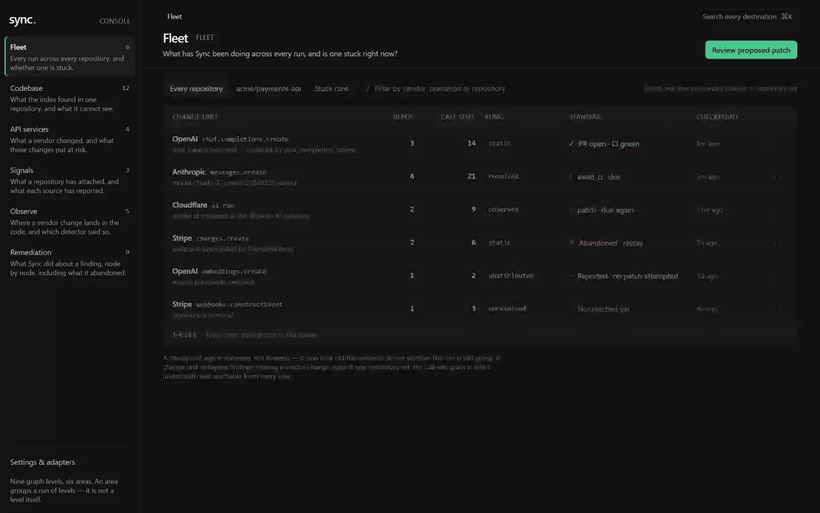

<div align="center">

# Sync

### Self-maintaining API integrations

**Sync watches the third-party APIs your code calls. When one breaks, drifts, or starts costing you money, it opens a pull request that fixes your code — already verified green by your own CI.**

[](https://www.python.org/)
[](https://github.com/langchain-ai/langgraph)
[](https://www.postgresql.org/)
[](LICENSE)
[](#status)



**The operator console — every screen in one pass.** *This is the design mock, not shipped code.*
[What is built today](docs/why-sync.md#the-operator-console) · [the mock](docs/console-mock/)

</div>

```
vendor ships a breaking change  →  Sync finds every call site that depends on it
                                →  patches them
                                →  runs your CI
                                →  opens a PR carrying the evidence
```

## Run it

Every command here runs in an ordinary terminal — no coding agent, no prefix. Every path ends at
the same console: **http://127.0.0.1:4173**, password `sync-local-demo` unless you exported
`SYNC_CONSOLE_PASSWORD` first.

### From a checkout — one prerequisite, and it is Docker

```bash
git clone https://github.com/stroland02/sync.git
cd sync
npm start
```

`pnpm start` is the same command; both hand over to `docker compose`, which brings up Postgres,
the schema, the API, and only then the console. First run builds everything (282 s measured, 22 s
after); `docker compose -f docker-compose.demo.yml build` moves that wait earlier. Only the
console is exposed, on loopback. `npm run down` stops it and removes its database.

**Stated here rather than discovered: the console comes up empty.** Nothing yet indexes a
repository into a fresh container — `B188` in `docs/superpowers/BACKLOG.md` carries the ways out.
Until that lands, this shows you that the product runs, not what it finds in your code.

### No admin rights? No Docker? Still runs.

```bash
npm run no-admin
```

Everything in user space from a checkout: an embedded Postgres in `~/.sync-postgres`, a pinned
Python built by `uv`, the schema, a fixture, the same console. Nothing elevated, nothing
machine-wide, and it adopts what a previous run already set up rather than rebuilding it.
Windows-only today; `B191` carries the rest.

### One command — published, and honest about what remains

```bash
npx @stroland02/sync-up
```

This is where the install story ends: that one command, on a machine that has never seen this
repository, reaching the console password prompt. The package is published and the command
resolves — the registry refused the bare name `sync-up` as too similar to an existing package,
so it lives under the owner's scope, and the command it installs is still `sync-up`. What it
can do without a checkout is check your machine and hand you the clone that works; one step
closes the rest of the gap: a prebuilt image for the registry form to pull (`B190`). Until
then, the checkout above is the same work and runs today.

### From source, for working on Sync itself

Python 3.12, `uv`, Node 22.22+, Postgres on 5433 — **[docs/developing.md](docs/developing.md)**
carries the prerequisites, the install, and the quality gates.

## Status

Pre-alpha, and specific about it: the full loop — real breaking change to CI-green pull request,
unattended — **has happened once**, with three qualifications that change what that means.
[Where it stands](docs/why-sync.md#where-it-stands-and-specific-about-it) carries the result, the
qualifications, and what is actually measured.

## Read further

- **[Why Sync exists](docs/why-sync.md)** — the problem nobody owns, the journey, the honesty
  discipline, and where it stands. **Start here.**
- **[How it works](docs/how-it-works.md)** — provenance rungs, the remediation state machine, the
  tier cascade, durable execution, containing the agent.
- **[Architecture and stack](docs/architecture.md)** — the shape of the system and the constraints
  behind it.
- **[Working on Sync itself](docs/developing.md)** — from-source setup and the quality gates.
- **[Beta readiness](docs/superpowers/plans/2026-08-18-beta-readiness.md)** — what stands between
  here and a stranger running this.

## License

Apache-2.0. See [LICENSE](LICENSE).
