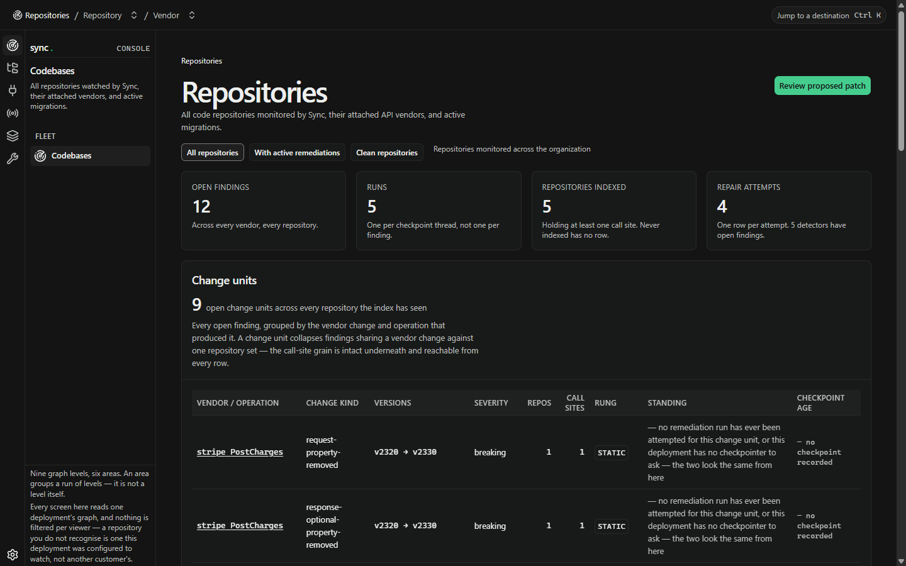
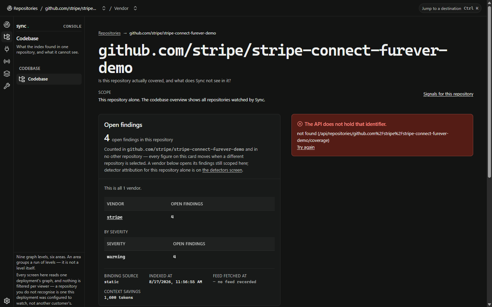
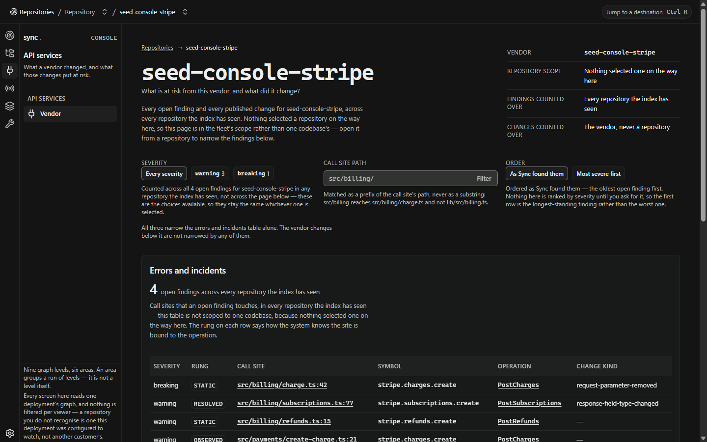
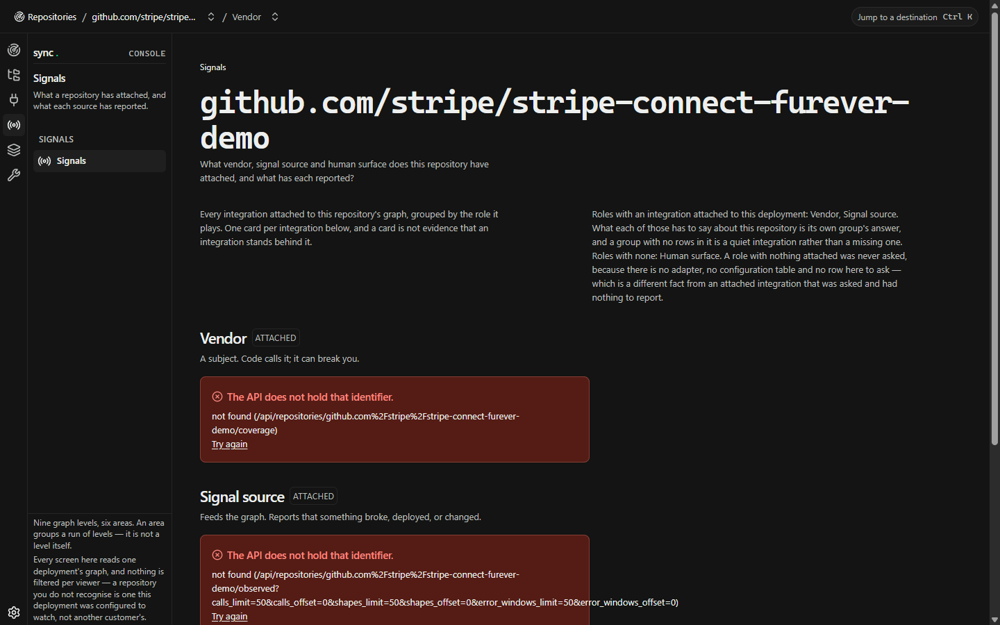
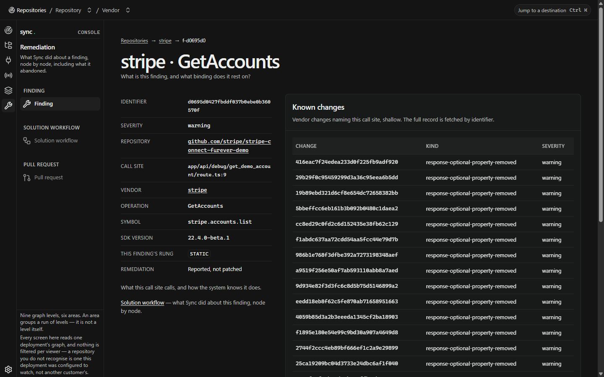
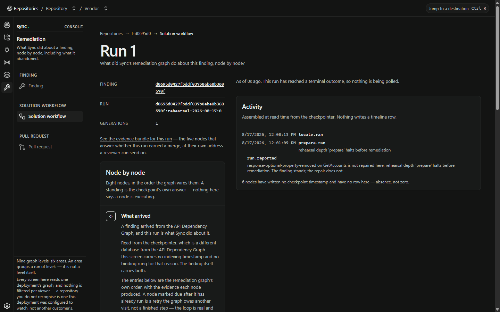
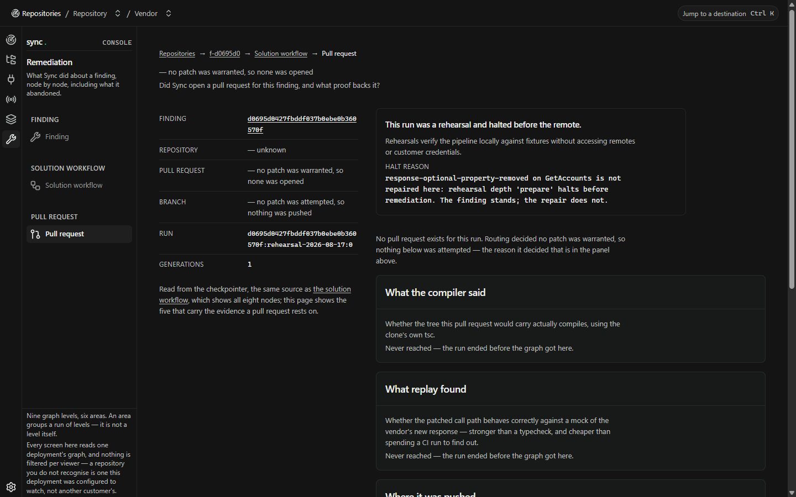
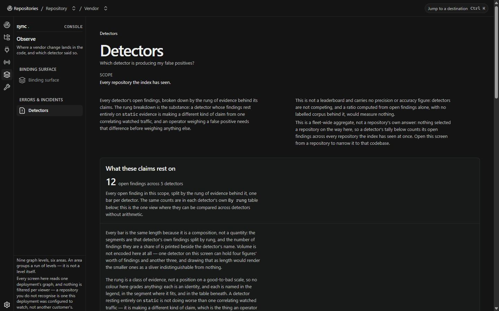
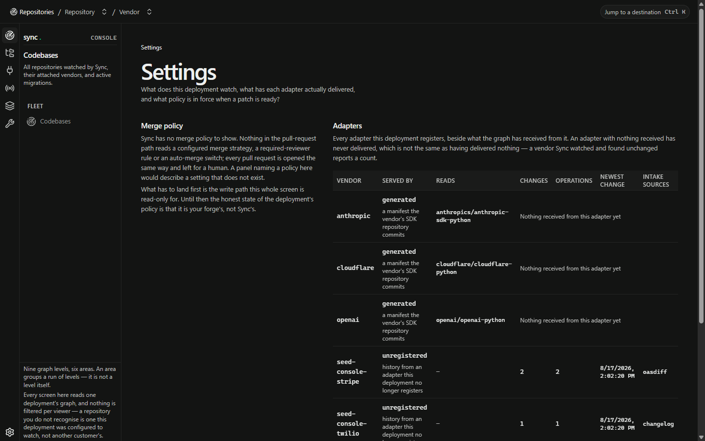

# The operator console, as it looks today

**Captured 2026-08-17 at 1440×900** from a production build served as static assets behind the
shared-credential gate, against a seeded graph. Every image below is a real screenshot of the running
console — not a mockup, not a drawing.

Regenerate the whole set with one command; see [Regenerating these](#regenerating-these) at the
bottom.

> **What you are looking at is the seeded fixture, not a customer's data.** Repository and vendor
> names come from `scripts/seed_console.py`. The screens are real; the rows in them are a fixture.
> `docs/superpowers/plans/2026-08-17-sync-watches-sync.md` is the plan to point the dev console at
> this repository's own graph instead.

---

## Repositories — the landing screen

The fleet-wide view: what Sync is watching and what needs acting on.



Worth noticing, because each is a deliberate decision rather than a style:

- **The STANDING column says what it cannot know.** *"no remediation run has ever been attempted for
  this change unit, or this deployment has no checkpointer to ask — the two look the same from
  here."* It names the two kinds of nothing it cannot tell apart instead of picking one.
- **`REPOSITORIES INDEXED 5 · Never indexed has no row.`** A count that says what it excludes.
- **No health score anywhere.** There is no composite figure, no traffic light and no green dot, and
  that is a standing refusal rather than an omission: a scalar averaging three gates would collapse
  *"we could not check"* onto the same axis as *"we checked and it passed"*.
- **The footer names the deployment's scope**, so an unfamiliar repository reads as one this
  deployment watches rather than as somebody else's data.

## Codebase — one repository



## API service — one vendor



## Signals — what is attached, and what each source reported



This screen carries the clearest statement of the never-measured distinction: a role with nothing
attached *"was never asked, because there is no adapter, no configuration table and no row here to
ask — which is a different fact from an attached integration that was asked and had nothing to
report."*

## Finding — one call site at risk



## Solution workflow — what Sync did about it, node by node

The screen the product's argument rests on, and the one worth looking at longest.



- **The outcome sits inside the sequence**, at the node the run actually reached — not in a banner
  at the top. A reader sees *where* the run stopped rather than being told *that* it stopped.
- **Nodes that never ran say "never ran"**, not "not yet". Terminal is different from pending.
- **The Activity panel says how it was built**: *"Assembled at read time from the checkpointer.
  Nothing writes a timeline row."*
- **Absence is counted, not hidden**: *"6 nodes have written no checkpoint timestamp and have no row
  here — absence, not zero."*
- **Nothing claims the run is alive.** There is no pulse and no dot, because a run parked on a
  customer's CI and a run that has died write the same nothing into a checkpoint.

## Pull request — the evidence bundle



## Detectors — which detector is producing false positives



Every bar is the same length on purpose: the segments are a composition, not a quantity. Encoding
volume as length would draw a detector holding three findings as a sliver indistinguishable from
nothing, next to one holding ten thousand.

## Settings — what this deployment watches



The adapter table renders **"Nothing received"** rather than `0`, over a heading that states the
rule: an adapter with nothing received *has never delivered*, which is not the same as having
delivered nothing.

---

## What is not shown here

- **The empty state** — a fresh deployment before anything is indexed. It is walked and recorded in
  `superpowers/reports/2026-08-17-gate-3-empty-state.md`.
- **The abandoned run**, which needs a finding whose newest generation abandoned;
  `superpowers/reports/2026-08-17-abandoned-run-walk.md` renders and describes it.
- **The drawn reference**, `docs/console-mock/`, and how far the build is from it — measured
  property by property in `superpowers/reports/2026-08-17-visual-eval-first-run.md`.

## Regenerating these

```sh
uv run python -m sync.api                                  # the API, on 8787
uv run python scripts/seed_console.py                      # the fixture
cd web && npm run build
SYNC_CONSOLE_PASSWORD=<a-credential> node scripts/serve-console.mjs
node scripts/capture-console.mjs                           # writes a dated directory
```

`capture-console.mjs` reads its subjects off the running API rather than hardcoding them, so a
reseed cannot quietly fill the directory with not-found screens, and it waits for every panel to
resolve before the shutter — a screenshot of a half-loaded screen looks like a design decision to
whoever opens it later.
